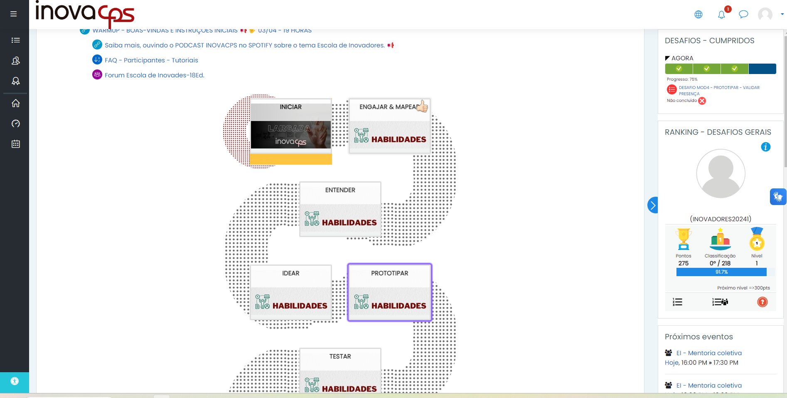
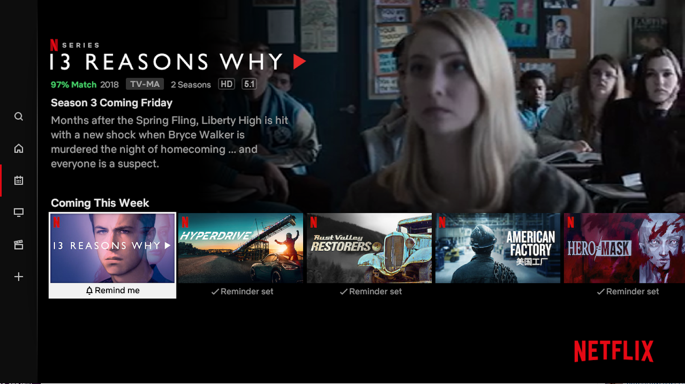
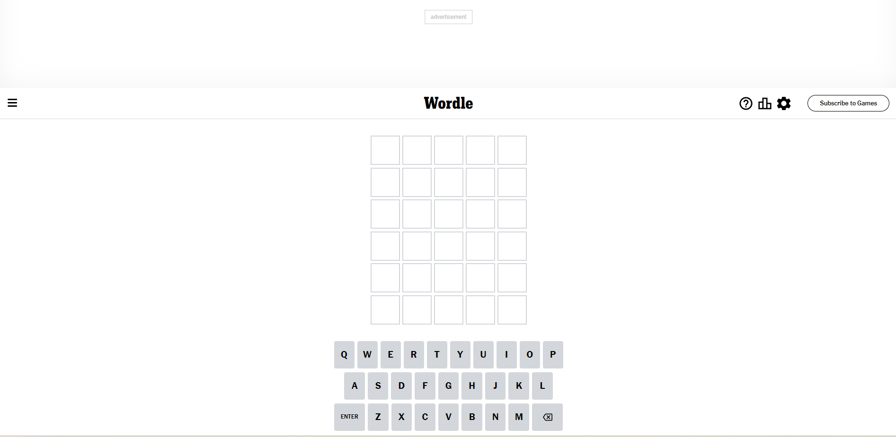

neste caso diversas heuristicas foram ignoradas, a 1 quando se tem uma pagina nao encontrada mas com conteudo ao redor, causando confusão de onde o ususario se encontra. A 5 devido ao fato de eu ter sido direcionado para essa pagina apos acessar o link dentro da propia pagina. A 8 devido ao fato da poluição de informações na tela.

este caso ignora duas heuristicas, a 2 quando se tem uma tela muito diferente do que ususarios estao acostumados a ver e a 8 com um design muito complexo e confuso dando uma margem de interpretação muito grande ao usuario.

o caso mais comum que é ignorar a heuristica 8 e criar designs muito complexos, onde se tem diversas opçoes para o usuario clicar, mais imagens se movimentando no centro da tela.

Um dos melhores exemplos de boas praticas com relação as heuristicas é os padrões que o google adota, possui um design minamalista como diz a heuristica 8, existe a consistencia de padroes da heuristica 4, tem a correspondencia com mundo real, visto que se tem a moda universal da barra de pesquisa com a lupa atendendo a heuristica 2.

ao acessar um pagina que nao existe/acionar algum erro, nao existe nenhum tipo de informação ao usuario , ignorando a heuristica 1 e 9, que dizem que o ususario deve sempre saber onde esta no software e deve sempre ser orientado de como resolver o problema

Uma pagina que acerta em algumas heuristicas e peca em outras, no caso da 6 onde se tem o reconhecimento ao inves de lembrança, uma pagina que permite saber o que cada ponto do site faz junto da heuristica 2 com a ideia de usar um modelo parecido com a vida real, lembrando algo como um jornal. porem é uma pagina que no caso da heuristca 8 do design minimalista deixa a desejar tendo muitas opções para o usuario decidir.

o GIthub é um otimo exemplo de como a heuristica 7 deve ser aplicada, possui a opção "secreta" de abrir um editor no propio navegado ao pressionar o ".", isso permite a usuarios mais experiente acessarem uma função que nao é tao conhecida ao publico geral.

um bom exemplo de uma pagina de erro, atendendo a heuristica 1 ,6 e 9, mostra ao usuario onde ele esta, o que ocorreu, sugere como resolver e fornece as informações e opções necessaria para tal usando uma linguagem mais proxima do usuario. 

uma plataforma confusa, contendo muitas opções para o usuário selecionar, onde muitas delas acabam levando para o mesmo lugar, fazendo com que as heuristicas 1,4,6 e 8. não tendo uma visibilidade clara de onde o usuario se encontra, não tendo um padrão consistente no site, quebrando a ideia de reconhecer ao inves de memorizar e por ultimo possuindo um design muito poluído.

um bom exemplo de  heurísticas sendo corretamente implementadas, o uso de icones que ja são padrão, como o caso da lupa para buscar, segue a ideia da segunda heuristica que diz que deve existir relação entre o sistema e mundo real, também existe a liberdade do usuario como diz a heuristica 3, onde o usuario pode parar um episódio no meio e retornar para a parte onde parou a qualquer instante, além disso tudo segue um design minimalista como prega a heuristica 8.

wordle se tornou um dos jogos mais famosos nos ultimos tempos e, não atoa, segue as heuristicas com coerencia, possuindo um desgin muito simples como diz a heuristica 8 e liberdade para o usuário digitar a palavra que quiser, apagar ou mudar uma letra especifica como diz a heuristca 4. Segue também a ideia apresentada na heuristica 5, com o fato de nao poder colocar palavras nao existentes ou so um monte de letras aleatorias. A heuristca 9 é abordada de um modo um pouco diferente, ao inves de ajudar com erros a ideia é implementada na mecanica do jogo, onde cada letra mostra se esta correta ou não.  