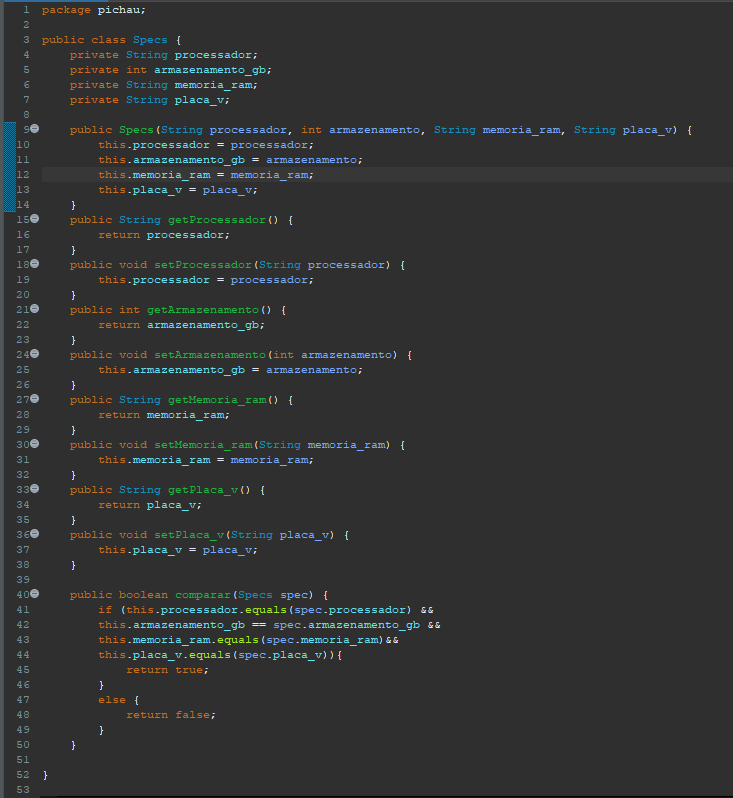
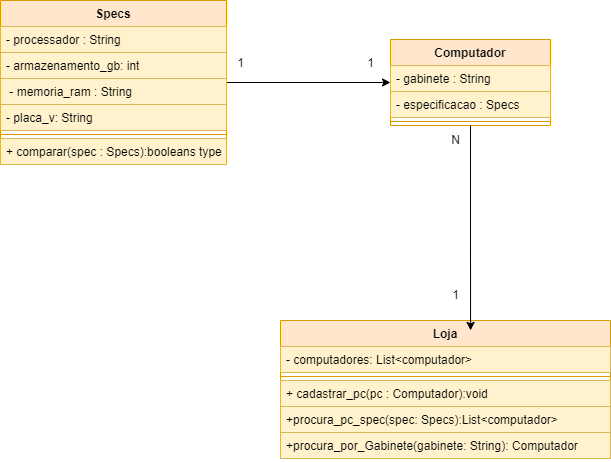

Este é um projeto simples de uma loja de computadores chamada Pichau. O objetivo é fornecer classes Java que representam computadores, suas especificações e a loja que os vende.

Estrutura do Projeto

O projeto consiste em três classes principais:

#Computador (Computador.java)

Representa um computador e suas informações básicas.

#Loja (Loja.java)

#Specs (Specs.java)

Representa as especificações técnicas de um computador.

Uso do Projeto

Exemplo de Uso (Main.java)

Um exemplo de uso do projeto está disponível na classe Main.java. Neste exemplo, alguns computadores são cadastrados na loja Pichau.

Funcionalidades Principais

Cadastro de Computadores:

Computadores podem ser cadastrados na loja usando o método cadastrarPc.

Procura por Especificações:

A loja permite procurar computadores com determinadas especificações usando o método procuraPcSpec.

Procura por Gabinete:

É possível procurar um computador por meio do gabinete usando o método procurarPorGabinete.

Listagem de Computadores:

A loja fornece a lista de todos os computadores cadastrados com o método getComputadores.

Exemplo de Uso

Um exemplo prático de uso do projeto está disponível no arquivo Main.java. Nesse exemplo, alguns computadores são cadastrados na loja Pichau, e são feitas buscas com base em especificações e gabinetes.

abaixo o diagrama de classes do projeto

